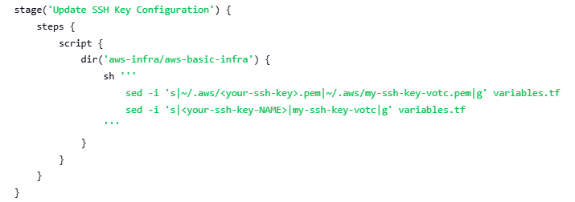

## An example of using Jenkins to build and deploy an AWS Template for Basic Infrastructure

<i>Build AWS Basic Infra pipelines will use the following GitHub repositories:</i>

- <a href="https://github.com/rodneyazev/aws-templates-for-basic-loadbalancer-and-auto-scaling-infrastructures.git">AWS Templates (Basic Infra)</a>
- <a href="https://github.com/rodneyazev/checking--my-dev-docker-env">A simple Java API (checking--my-dev-docker-env)</a>

### Requirements:

- AWS CLI
- Terraform
- Ansible
- 01 Key Pair (EC2)

<i>P.S.: If you are using any APT GNU/Linux distribution, you can install them using my <a href="https://github.com/rodneyazev/just-a-devops-toolkit-wsl-linux">just-a-devops-toolkit-wsl-linux</a></i>

<p align="center">
  
</p>

<i>Don't forget to prepare your Jenkins environment by running the following pipelines:</i>

- Install Basic Applications
- Install DevTools

# Jenkins

### Install Jenkins container:

```
docker compose -f jenkins.yml up -d
```

### Get Jenkins password:

```
docker exec -it jenkins /bin/bash -c "cat /var/jenkins_home/secrets/initialAdminPassword"
```

### Jenkins plugins installation (if nedeed):

- Docker API Plugin
- Docker Commons Plugin
- Docker plugin
- AWS Credentials Plugin
- AWS Web Services SDK
- Amazon EC2 Plugin
- GitHub Plugin

### You will need to copy SSH Keys to Jenkins container:

E.g.:

```
# Create folder
docker exec jenkins mkdir -p /root/.aws

# Copy SSH Keys

docker cp ~/.aws/my-ssh-key-votc.pem jenkins:/root/.aws/
docker cp ~/.aws/my-ssh-key-votc.pem.pub jenkins:/root/.aws/
```

## Jenkins Pipelines

#### Add New Task


#### Create Pipeline


#### Choose one of them, copy its content and save it


<br>


## Changes that can be made

#### Region and S3 name


#### GitHub Repository


#### SSH Key


## Result:


<br>


<br>


That is it.